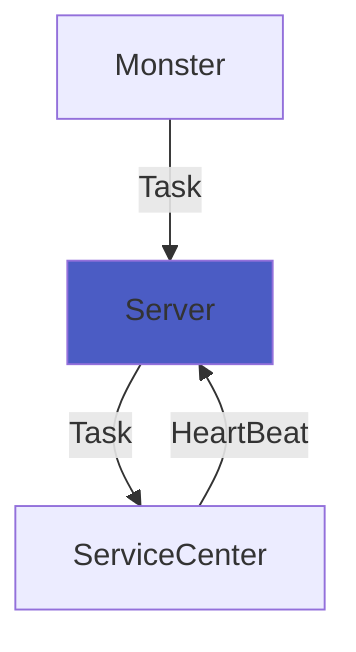

# CloudCluster

本项目实现了基于Windows系统下基本的远程操作和命令执行功能，采用易语言编写，总共由如下三个组件组成。

1. 远端客户（CloudClusterServiceCenter）
2. 服务端（sct-base）
3. 管理应用（Monster）



ServiceCenter需要通过Installer注册为系统服务以完成安装，下面介绍配置过程。

# 配置过程

## SCT-Base

作为CloudCluster的核心组件，sct-base的重要性不言而喻，其作用如下。

1. 用户鉴权
2. 数据存储
3. 反弹Shell服务端

要部署sct-base，请先安装数据库软件。鉴于暂无成熟的多数据库驱动方案，目前只支持使用mysql作为数据库程序。在安装完成后，请创建一个数据库供sct-base使用，并使用sct-server目录下的`structure.sql`初始化数据库结构。

需要注意的是，sct-base只支持通过`mysql_native_password`插件登录数据库，请提前配置数据库用户鉴权插件。

在数据库配置完成后，请打开sct-server目录下的`sct-base.e`文件，修改以下五项。

1. 常量表->KEY（修改为随机字串即可）
2. 常量表->mysql_host
3. 常量表->mysql_user
4. 常量表->mysql_passwd
5. 常量表->mysql_dbname

不建议使用root用户作为程序的数据库用户，因为本程序接口设计并未过滤特殊字符，采用拼接方式构造sql语句，具有sql注入风险。若您对安全性有要求，可在`Main->HandleFun`函数下编辑url参数字符过滤规则。

配置完成后，请编译程序，得到`sct-base.exe`。您可以使用：

```shell
sct-base.exe -port 8071
```

启动一个实例。在客户数量较多时，为了性能考虑，建议您使用API网关对本服务做负载均衡。需要注意的是，若您使用连接池，对于单个实例，推荐的连接池最大连接数为20-40，超时时间控制在1-5分钟，若连接数过多或超时时间过长，可能导致后端服务正常的情况下，请求大规模返回502。在`sct-server`目录下，提供了`ecosystem.config.js`文件。若您有nodejs环境，可使用pm2方便地管理本服务，监控并在程序崩溃时自动重启。

## ServiceCenter

对ServiceCenter的配置较为简单，只需打开`dllmain.e`，并修改下列项。

1. 常量表->server

修改为刚刚配置的`sct-base`服务的url即可，假如您配置的url为`http://127.0.0.1:8070/`请确保`http://127.0.0.1:8070/status`可访问并返回`ok`。

编译后得到`CCServiceCenter.dll`备用。

## ServiceCenter-DNS

在CloudCluster-DNS分支中，提供了基于DNS查询服务器地址的ServiceCenter程序。配置过程如下。

打开`dllmain.e`，并修改下列项。

| 项名               | 描述                                     | 示例值            |
| ------------------ | ---------------------------------------- | ----------------- |
| 常量表->dns_server | 用于dns查询的公共（或私有）dns服务器地址 | 1.1.1.1           |
| 常量表->dns_atlas  | 指向您的真实服务器域名的CNAME域名记录    | cname.example.com |
| 常量表->dns_suffix | 用于拼接完整ServiceUrl的后缀文本串       | /                 |

配置完成后，您可以通过访问`http://`+`CNAME目标域名`+`dns_suffix`+`status`检查配置是否无误。

DNS版本的ServiceCenter具有一个限制，即您必须将SCT-Base服务直接部署（或通过反向代理）暴露到`80`端口上，并配置域名指向其。

## Installer

此为ServiceCenter的安装器，请您打开`CloudCluster-Installer.e`并做如下一项修改。

1. 资源表->图片或图片组->module

将此内容修改为刚刚编译得到的`CCServiceCenter.dll`即可。编译Installer，得到`setup.exe`安装文件。

请确保`setup.exe`的清单中配置了“运行前请求UAC”权限，这非常重要。若没有此项，在运行`setup.exe`前，请选择“以管理员方式运行”。

## Monster

对管理应用的修改非常简单，请您打开`CloudCluster-GUI.e`，并做如下一项修改。

1. 常量表->baseURL

配置等同`ServiceCenter`的`server`。

假如您配置的baseURL为`http://127.0.0.1:8070/`请确保`http://127.0.0.1:8070/status`可访问并返回`ok`。

编译程序即可。

# 运行

## Init Admin

要注册用户账户，请先将`SCT-Base`目录下的`data/config.ini`中的`debugMode`设置为`true`，并启动服务器。

以`GET`方式访问您配置的`baseURL`下的`manage/register`接口，传入以下三个参数。

| 参数名   | 类型 | 注释     | 必须 |
| -------- | ---- | -------- | ---- |
| username | 文本 | 用户名   | 是   |
| password | 文本 | 明文密码 | 是   |
| perm     | 整数 | 权限配置 | 否   |

若`perm`未设置，则默认为`0`，即新创建的用户除了登录无法进行任何操作。一般来说，管理员账户将此项设置为`100`即可。

另外需要说明的是，`SCT-Base`的常量表中存在一个`key`，该项决定了用户密码的加密方式，若修改了，则之前使用该`key`注册的用户将全部无法登录！

## Install

在目标计算机上运行`setup.exe`，选择`1`安装ServiceCenter，正常情况下安装程序会显示绿色字体，并提示服务已启动。

此时，启动Monster.exe并登录，您可以在主机列表中看到已经注册成功的计算机。

您可以对其执行一些命令，具体如下。

### 下载文件

```
wget
http://127.0.0.1/download.zip
a.zip
```

首行为命令名称，第二行为文件url，第三行为保存文件名。在下载完成后，您可以在主机列表的消息中看到汇报讯息。

### 执行命令

```
cmd
curl http://127.0.0.1:8070/status
del C:\Windows\TEMP\a.zip
```

执行任意dos命令，cmd下可以跟多行命令，会被依次执行。需要注意的是，执行这些命令的cmd实例并非同一个，所以上一行设置的环境变量无法被下一行的命令所读取。

## 环境变量

您可以在命令框输入以下行来定义任意环境变量，定义行以`#`开头，后跟`key=value`。

```
# a = 1
# b = 200
# Hello, CloudCluster
```

若没有明确的`Key-Value`对应关系，该行将被忽略。

以下为目前可选的环境变量列表

| 变量名 | 默认值              | 描述                                   |
| ------ | ------------------- | -------------------------------------- |
| runAt  | 1970/01/01 00:00:00 | 表示当前命令仅会在达到指定时间后执行。 |

## Uninstall

您可以启动`setup.exe`，并选择`2`以卸载`ServiceCenter`的全部组件，并删除服务。

# 更新日志

## 1.1

1. 实现命令定时执行功能。
2. 优化程序逻辑。

----


## 1.0

Initial Version